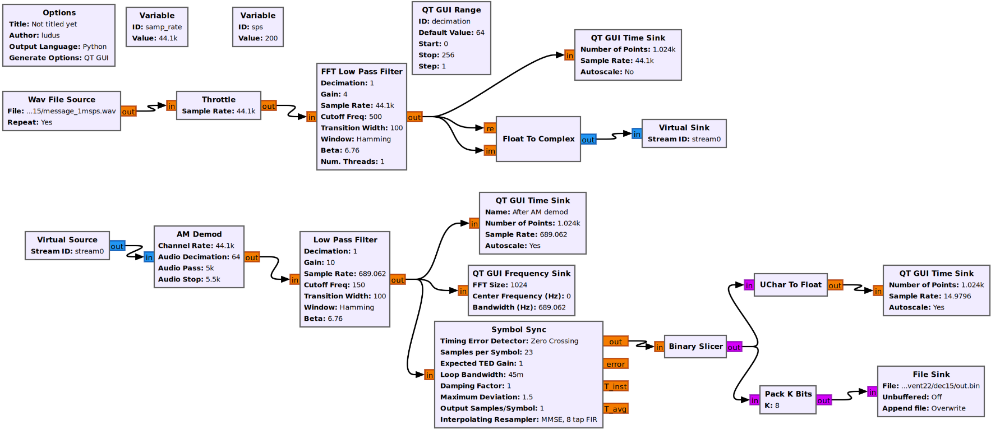

# [HV22.15] Message from Space

<table>
  <tr>
    <th>Categories</th>
    <td>Wireless, Forensic</td>
  </tr>
  <tr>
    <th>Level</th>
    <td>hard</td>
  </tr>
  <tr>
    <th>Author</th>
    <td>cbrunsch</td>
  </tr>
</table>

## Description
One of Santa's elves is a bit of a drunkard and he is incredibly annoyed by the banning of beer from soccer stadiums. He is therefore involved in the "No Return to ZIro beer" community that pledges for unrestricted access to hop brew during soccer games. The topic is sensitive and thus communication needs to be top secret, so the community members use a special quantum military-grade encryption radio system.

Santa's wish intel team is not only dedicated to analyzing terrestrial hand-written wishes but aims to continuously picking up signals and wishes from outer space too. By chance the team got notice of some secret radio communication. They notice that the protocol starts with a preamble. However, the intel team is keen to learn if the message is some sort of wish they should follow-up. Can you lend a hand?

## Solution
A Software-Defined Radio (SDR) challenge, yay! My turf - or not o_0.

The provided `cu8` file seemed to contain "complex unsigned 8" data sampled at 1 mega-samples per second (hence 1msps in the file name).

Since I had GNU Radio Companion (GRC) installed on my machine, I researched on how to open and process cu8 files with it. Not much luck, though... 

I decided to load the cu8 file in Audacity (as it seems to be able to open this kind of "raw data" files) and convert it to a `wav` file, which was readable by GRC ([see here](https://github-wiki-see.page/m/merbanan/rtl_433/wiki/View-a-saved-cu8-file)).

Subsequently, I processed the signal in GRC with the following flowgraph:



Finally, I post-processed the binary data with a [custom script](./nrzi.py) to decode the differential "non-return to zero inverted" encoding of the signal.

```python
#!/usr/bin/env python
lst = "000000101010[...]" # the binary output from GRC in ASCII form (use CyberChef, for example.)


out = ""
prev = ''
for i in lst:
    if prev == '':
        prev = i
    else:
        if i == prev:
            out += '0'
            prev = i
        else:
            out += '1'
            prev = i

print(out)

# Prints:
# 000001111111111111[...]
# Decoded part includes: "SFYyMnt2LXdpc2gtdi1nMHQtYjMzcn0=" after the 0xFFFF preamble.
# Base64 decodes to "HV22{v-wish-v-g0t-b33r}"
```


### Links
- NRZI: https://en.wikipedia.org/wiki/Non-return-to-zero
- Inspectrum (would have been a good tool for this): https://github.com/miek/inspectrum
- How to use inspectrum (shared by bread): https://youtu.be/M6vUJbav1VE
- Universal radio hacker (would have been an even better tool for this): https://github.com/jopohl/urh

## Flag
```
HV22{v-wish-v-g0t-b33r}
```
