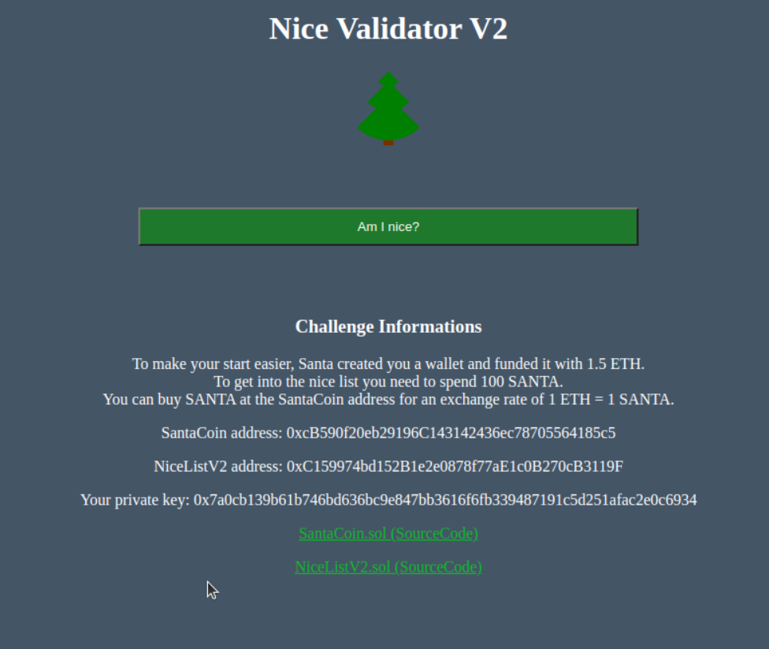
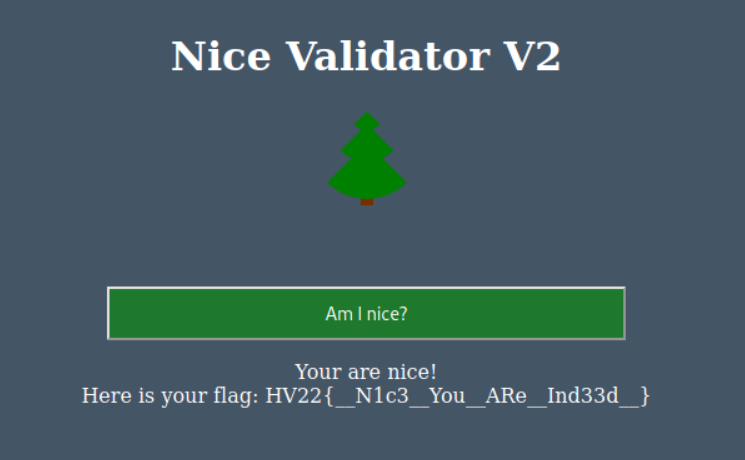

# [HV22.19] Re-Entry to Nice List 2

<table>
  <tr>
    <th>Categories</th>
    <td>Exploitation</td>
  </tr>
  <tr>
    <th>Level</th>
    <td>hard</td>
  </tr>
  <tr>
    <th>Author</th>
    <td>HaCk0</td>
  </tr>
</table>

## Description
The elves are going web3! Again...

After last years failure where everybody could enter the nice list even seconds before christmas, Santa tasked his elves months before this years event to have finally a buy-in nice list that is also secure. To get the most value out of this endavour, they also created a new crypto currency with their own chain :O The chain is called SantasShackles and the coin is called SANTA.

Try to enter the nice list and get the flag!

## Solution
The provided web service looks as follows:



The two provided contracts can be found here:
- [NiceListV2.sol](./NiceListV2.sol)
- [SantaCoin.sol](./SantaCoin.sol)

So the goal was to get onto the nice list by bumping my credit amount to 100 SANTA somehow and buy in.
To do so, I had to find 98.5 SANTA somewhere since my current credit was at 1.5 ETH/SANTA only.

As the name of the challenge already hints, a re-entrancy bug needs to be abused to get the required buy in amount.

The "last years failures" refers to previous Hackvent challenges, such as [Re-entry to Nice list in Hackvent 2021](https://sigterm.ch/?p=1696#HV2121_Re-Entry_to_Nice_List).

After struggling quite a lot with understanding the setup and relationships between contracts, SANTA and ETH, I finally managed to mentally parse the material :).

### The path forward
To get the 100 SANTA in order to buy in to the nice list, we need to exploit the re-entrancy bug on the `NiceListV2.sol` contract.
More concretely, the contract does not protect the functions `withdrawAsEther` and `withdrawAsCoins` the same.
Namely, the `nonReentrant` clause is missing on the `withdrawAsCoins` function.

Therefore, we can invoke `withdrawAsEther` from a specially crafted contract and equip the `receive` function such that `withdrawAsCoins` is called before `withdrawAsEther` returns.

This core part of the exploit looks as follows in the [attacking contract named LudusContract](./LudusContract.sol):

```solidity
function withdraw(uint amount) public {
    niceList.withdrawAsEther(amount);
}

receive() external payable{
    if (msg.sender != owner){
        niceList.withdrawAsCoins(msg.value);
    }
}
```

Around this, we had to do some logistics to convert from ETH to SANTA coins, approve amounts, buyIn, etc.

In the end, using the attacking contract, I had to run the following manual operations:

1. Create an instance of `LudusContract` along with references to `NiceListV2` and `SantaCoin` and transfer 1.2 ETH to it.
2. Run the `exploit` function on `LudusContract` with parameters
    - `amount` = 1 ETH
    - `loops` = 20

At this point, the contract will have balances of ~1 ETH and 20 SANTA.

3. Repeat the same transaction 4 more times (for some reason, doing the loop 100 times breaks something and the system becomes unresponsive).

4. Invoke the `gimme` function on `LudusContract` to transfer 100 SANTA to my address.
5. Approve the `NiceListV2` contract as a spender of 100 SANTA on my behalf on the `SantaCoin`.
6. Buy in on 100 SANTA to `NiceListV2`.

At this point, invoking the `isNice` function on the `NiceListV2` contract should return true and I could go back to the "Nice Validator" web UI and click the `Am I Nice?` button, displaying the flag 🎉



## Notes
A few useful notes:

- "payable function": The keyword payable allows someone to send ether to a contract and run code to account for this deposit. In summary, a payable function is a function that can receive ether. It provides the developer with the opportunity to respond to an ether deposit for record-keeping or any additional necessary logic. (source: https://docs.alchemy.com/docs/solidity-payable-functions)
- 1 ETH is 10^18 Wei (or 1000000000000000000)
- Web3.py has the function `Web3.toWei(1, "ether")` to convert between Weis and ETH.


## Links
- https://consensys.github.io/smart-contract-best-practices/attacks/reentrancy/ (from mcia)


## Flag
```
HV22{__N1c3__You__ARe__Ind33d__}
```
